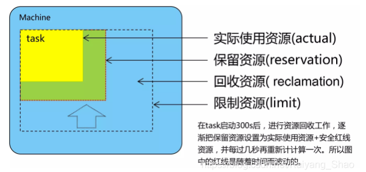

Brog：Google大规模集群管理实践

## 背景

大集群的管理调度已经是一个长久课题，各大公司均有涉猎，比如Mesos、YARN、Tupperware、Fuxi

Google内部的集群管理系统是Borg，特点：

1. 隐藏资源管理细节，隐藏failure处理，**让开发者只需关心应用开发**
2. Borg本身高可靠、高可用，Borg也可以**让运行在上面的应用高可靠、高可用**（Reliability：连续最长运行时间，Availiability：最低可运行时间比例）
3. **高效**让workload分散运行在数万机器上运行

Borg上运行了Google大量的服务：Gmail、Docs、Search、Bigtable、MapReduce...

资源质量：

生产服务分配了70%的CPU，55%的内存，CPU利用率占集群的42%，内存利用率占集群的46%。外加非生产服务，应该可以更高，但无数据纰漏。

## 概念

1个cell是1个Borg集群，cell内机器异构，集群大小的中位数是1万Node。

Borg上运行的是用户提交的job，job可以是多种workload类型。

job又分2类：

- LS：latency sensitive，主要是在线服务，也有非在线服务，为production。
- Batch：批处理，none-LS，为none production

这与Mesos、Sparrow等调度器对job的划分有区别，那些调度器分为：long job、short job，是按运行时间划分，并且考虑的主要点是 最小化调度延迟，以增加集群调度效率和负载。

Job可以有constraints，可以调度到有这些atrribute上Node上运行（类K8s affinity）

job由task组成，每个task是一个进程运行在container/cgroup中，而不是VM。对于GAE上的外部应用，是运行在KVM上。task可以更新，甚至无需restart。

采用 BCL 描述Job，（k8s中是使用声明式API描述一切）

Job有无重叠优先级：monitoring、production、batch、best effort。生产服务主要是monitoring和production优先级，离线是后面2个优先级。

优先级会带来抢占，被抢占的任务不会即可重调度，而是挂到队列，防止高优先级的Job依然资源不足，还会不停抢占。

名字服务：与K8s类似，在Borg内可以直接通过 50.foo.bar.cc.borg.google.com 访问到实例(task)

监控：所有task通过http自动上报指标和运行状态，以及执行历史，滚动日志文件。

## 架构

C++开发

论文图1

### Borgmaster

2部分组成：

1. borgmaster进程：与client、borglet交互，一主多从，使用paxos选主，以及保证提交数据的一致性。（提供Fauxmaster，代码上除与borglet交互部分，其他与borgmaster一致，目的是可以利用生产数据/checkpoint和算法进行多种实验验证）
2. 调度器：负责job的task调度，把task assign 到node上。

### 调度

job由clinets提交到borgmaster，borgmaster写入 paxos store后，所有改job的task进入pending队列等待调度。 scheduler 异步处理pending队列，并且采用优先处理高优先级的task，同一优先级的调度采用RR，确保调度公平性。

对一个task的调度分为2个环节：

1. 可行性检查（feasibility checking）：找到一批可以运行该task的nodes。主要考虑的点是task的constrain、资源是否充足（不足时，对于高优先级的task，会考虑驱逐低优先级task后的资源充足情况）
2. 打分（scoring）：对上批的nodes进行多维度打分，选择分数最高的作为运行task的node。
   3. 策略：E-PVM：又称worst fit，均衡分配，存在碎片导致大块job无法很好的分配，
   2. 策略：best fit：尽量把机器填满，这样大job容易分配了，但离线任务申请的cpu很小，比如0.1，它们需要在集群空闲时，尽量用cpu，但机器上没额外资源可用。
   3. √ 策略：混合策略：尽量避免一种资源分完了，而另外资源还空余。对于google的生产workload，效率有3~5%的提升。（此处效率应指总资源使用效率，即使用率）。

打分过程如果没有可用的node，则kill低优先级job，直到有node可选择。杀死的job不会驱逐，而是先放到挂起队列。

调度延迟：从提交到开始运行的时间。

- 中值是25s，80%的实际安装软件包依赖，打分时倾向于把job调度到已经有软件包依赖的机器上，减少调度延迟。【其他调度论文的重心】
- 使用torrent加速软件包分发。

### Borglet

1. 任务管理：启动、停止、failover重启。
2. borgmaster从borglet拉取机器状态。
   1. 不是borglet上报，防止请求风暴，borgmaster hold不住。
   2. borglet响应node上全量数据，borgmaster只提交增量数据到borgmaster leader。
   3. 如果borglet多次无响应，标记node不可用，且重新调度node上的任务。
3. 其他：日志旋转等

### 扩展性

指集群横向扩展，从小集群逐渐发展成大集群，Borg所存在的问题，以及优化方案。

1. borgmaster从最初的单进程同步处理调度请求，到拆分出调度进程，多线程响应borglet只读请求，以及为不同workload使用不同调度器。

大集群的调度很费时，效率低，提升扩展性还有项：

1. 打分缓存：在node上的状态未变化时，不重复打分。
2. 等价类：所有的job可归为几类，为每类job的node进行打分，而无需为每个job都计算打分。外加打分缓存，可以极大减少打分任务。
3. 随机化：本质是放弃全局视角，找到足够的打分机器，比如50个就进行打分，而不是对所有机器打分，找到针对task的全局最优。思考：集群的状态是瞬息万变的，那一刻的全局最优，在运行时未必是全局最优。全局最优带来的收益和成本符合log函数，我们可以做出平衡：20%的成本，获得80%的效果。

实验：优化后，几百秒可以完成整个集群所有workload的调度，如果去掉优化，3天还未完成。

## 可用性

这里是可用性，指的是让服务可用性的提升，而不是borg本身的可用性。

- 重调度evict任务
- 分散任务在多个node，尽量是不同电力单元、机架
- 升级os、node时，保证job的最小服务数（滚动升级）
- 声明式API可以重复提交（yaml本质是幂等的，是面向终态的提交）
- 对重调度的任务进行限流，因为Borg无法区分是大规模故障还是网络分区
- 避免把task重复调度到同一个node上，减少因task或node crash的概率

另外关键设计：borg本身的failover不会影响task的继续执行。

## 利用率

意义：提升1个点，对于1个集群即可节约百万、千万$。

评估方法不是利用率提升X%，而是：而是cell compaction，对于一个workload，找到该workload可以装进去的最小cell。

实验数据来自真实生产数据，每个实验会反复进行11次。利用率的实验针对的是调度器，使用Fauxmaster完成，而无需真实去调度。

#### 实验1：集群共享

在Borg集群混部production和non-production的job。

结果：分开部署在不同的Borg集群，比魂币需要多20~30%的的资源。

图5-a 左边是混部，右边时分开部署的资源

资源节约的原因：production通常会预留（未分配）较多资源保证可用性，Borg可以回收未使用的资源运行non-production的task。

#### 实验2：大集群

大集群可以减少资源碎片，小集群容易形成资源碎片。针对一批workload，寻找到能运行该workloads的最小单个集群，然后把集群拆分成小cell，运行这些workload。

图7-a

结果：如果这些小集群运行这些workloads，需要补充更多的node，拆分的越小，需要补入的机器越多。整体的利用率也就下降越多。

#### 实验3：细粒度资源请求

Borg上task请求的CPU单位是milli cores，而不是cores，Memory的单位是bytes，而不是GiB。

测试的办法是把请求的taskCPU的单位都转化0.5cores，memory的单位是Big。

图9

结果：无论是向上round-up，还是round down，结果都是1个集群容纳下这些任务，需要更多的机器。

理由：round up会造成大task独占node的情况增加，所以需要更多node。round down允许task进行pending，so what？如何解释？

#### 实验4：资源回收/超卖

job会设置limit，承诺该job使用的资源上限，limit对borg有2项用途：

1. 集群对job的准入，该用户是否还有足够的资源提交job。
2. node是否有足够的资源被调度给task。

task可以请求超过limit的资源，对于可压缩资源比如CPU，当使用量超过cpu limits时，borg可以把task的cpu用量压下来。对于不可压缩资源，比如memory、disk，borg会把这些task kill掉，OOM。

对于可以容忍低质量工作的job，可以进行超卖，通常情况下它们task使用的资源不会达到limit，如果把整个limit也都分给它，那大部分未使用的资源都是浪费。

borg评估task真实的资源使用量a，然后增加一部分的预留资源作为安全边际b，把a+b分配给task使用，把limit-(a+b)未使用的部分回收掉，再分配给其他task。

比如node有100c，task实际使用2c，limit为3c，如果不超卖node上分配3个task，如果超卖，node上可以允许4个task。

production是LS的，是不能容忍低质量的，不能进行超卖，batch job是none-production，延迟不敏感，可以进行超卖。实验1也证实了混部可以降低使用的node数量，提升资源效率。

图11：资源使用和资源预留的关系，当使用率达到50%时，预留值基本就设置100%了，意味着按limits分给task资源了

从图11也能看到预留是比较保守的，基本是使用量的2倍，还是留有较大的未使用资源。

激进一点，不预留太多资源，是否可以进一步减少node数量？是否带来副作用？

图12:

利用4周对1个app实验，第1、4周，使用当前默认的预留规则，第2周激进，第3周稍微不太激进，采用了激进和当前配置的medium。可以看到第2、3周的OOM数量增长了数倍，CPU和Memory的利用率也有提升，说明减少预留资源，可以提升资源利用率。评估之后，采用第3周的配置，应用到集群。

##### 超卖带来的问题

memory超卖会造成，即使task没有使用到limits，但node上资源不足时，低优先级的task被kill，然后重新调度运行。整个问题的成本包含2部分：

1. kill+重调度的latency
2. task重新运行的成本。对于没有【从断点继续运行】而是【从头开始运行】的task，且task为运行时间较长的类型，成本会是巨大的。

所以task是否接受超卖要决定，是cpu、memory都可以对我超卖，还是只接受cpu超卖？如果是short job或可以断点继续运行，可以考虑cpu、memory都超卖，否则只超卖cpu会是较好选择。

node上disk资源充足，通常无需考虑disk超卖。

## 隔离和安全性

安全隔离：Google内部使用container技术运行task，GAE运行外部应用使用VM或安全沙箱技术。

性能隔离：borg提供appclass（类似qosclass）来标记运行时资源供给优先级，production优先级的task，appclass为LS，为这些task提供绑核，保障cpu供给和减少在多核调度上的干扰，Memory上这些app不进行超卖，并且会驱逐低优先级的task。

图13:

展示了node cpu利用率对LS和share cpu的task 调度latency的影响，cpu利用率越高，2者访问到cpu 的latency都在增加，但LS因为绑核，增加较少。share cpu的task，latency增加较多。

## 总结

罗马不是一天建成的，Borg也是。venti也是。

学习其优秀的经验，设计思路。才能应用到其他软件，比如venti。

kubernetes是Google开源的，Borg的思想/经验也放到了Kubernetes中，其实这些年Kubernetes的优秀的东西，google也有反补到Borg中。

Borg的经验，不足部分：

1. 使用job对task分组方式不灵活，用户尝试更多灵活的分组方式。k8s中使用label对pod灵活分组。
2. node上所有的task共享IP，但一个node上同时运行多个task，task对外有暴露端口，borg提供动态的端口映射能力。k8s中更灵活了，可以为每个pod分配独立的ip。
3. borg为内部的高级用户提供了丰富的参数，这对大多数的、普通的用户造成了干扰，每个参数该怎么设置？解决方案是在borg运行自动化工具和服务，通过经验为应用设置参数。

好的部分：

1. borg上多个task公用的资源由alloc负责，在k8s中抽象成了Pod，Pod中运行容器可以来自不同image/不同的团队，对于sidecar容器模式就更容易。
2. 集群管理部仅仅是task管理。还包含name service和负债均衡。k8s 通过service自动实现这2项功能。
3. borg提供了好的debug和可观测性，比如event、task和日志自动处理和暴露给user。k8s中使用cAdvisor，Promethus，Fluentd等提供这些功能。如今，云原生图景中可观测性的项目也比较丰富。
4. maste是borg的核心，所有管理功能的入口都在master，扩展master的功能也比较容易。k8s设计上更进一步，api server为入口，处理请求和管理状态，使用controller负责各项功能，并且更易扩展。

## FAQ

1. K8s就是开源的Borg吗？
2. Borg和K8s谁更优秀？
3. Google内部使用K8s吗？为什么不放弃Borg，使用K8s？

## 参考
1. 论文：
2. Google 三代调度系统发展：https://www.douban.com/note/547709628